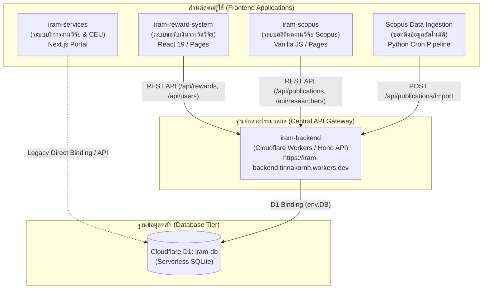
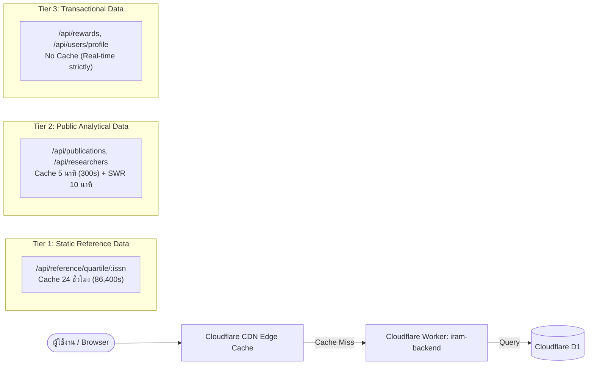

# เอกสารสถาปัตยกรรมฐานข้อมูล Cloudflare D1 (iram-db) และระบบนิเวศ iRAM Ecosystem

> **สถานะระบบ:** ใช้งานจริงบน Production (Cloudflare D1 & Cloudflare Workers/Pages)  
> **Database ID:** `d813fc54-881b-47b0-b6a0-6774afe3cf2f`  
> **ขนาดข้อมูลปัจจุบัน:** ~8.03 MB / 500 MB (1.61% ของ Quota พื้นที่จัดเก็บ)  
> **วันที่จัดทำ:** 29 กันยายน 2026  
> **ผู้รับผิดชอบระบบ:** คณะแพทยศาสตร์ มหาวิทยาลัยนเรศวร

---

## 1. ภาพรวมระบบนิเวศ (iRAM Ecosystem Overview)

iRAM Ecosystem ประกอบด้วย 4 ระบบหลักที่ทำงานร่วมกัน โดยมีฐานข้อมูล **Cloudflare D1 (`iram-db`)** และ **API Gateway (`iram-backend`)** เป็นศูนย์กลาง (Single Source of Truth) ดังแผนภาพ:



### รายละเอียดและหน้าที่ของแต่ละระบบ:

| ระบบ | เทคโนโลยี | URL / Hosting | หน้าที่รับผิดชอบหลัก |
| :--- | :--- | :--- | :--- |
| **`iram-backend`** | Cloudflare Workers, Hono, TypeScript | `https://iram-backend.tinnakornh.workers.dev` | **ศูนย์กลาง API Gateway** ควบคุมการอ่าน-เขียน D1 ทั้งหมด, ตรวจสอบสิทธิ์ (Auth/Role), ตรวจสอบความซ้ำซ้อน (Deduplication), และทำ Caching ป้องกันโควต้า |
| **`iram-reward-system`** | React 19, TypeScript, TailwindCSS, Vite | `https://iram-reward-system.pages.dev` | ระบบยื่นคำขอรับเงินรางวัลและค่าตีพิมพ์ (AWP) 12 ขั้นตอน, จัดการประวัติและสิทธิ์ผู้ใช้, รองรับ PDPA |
| **`iram-scopus`** | Vanilla JS, HTML5, CSS3, Python Scripts | Cloudflare Pages & Ingestion Pipeline | แสดงแดชบอร์ดผลงานวิจัย Scopus, สถิติ Quartile, กรองข้อมูลนักวิจัย, และมี Ingestion Script ดึงข้อมูลจาก Elsevier API |
| **`iram-services`** | Next.js, React, Node.js | Local / Cloudflare Deployment | ระบบบริการงานวิจัยภายใน (Consultation CEU, Ethical Approval IRB, Presentation ทุนนำเสนอผลงาน) |

---

## 2. สำรวจโครงสร้างตารางข้อมูลใน D1 (Database Schema Census)

ฐานข้อมูล `iram-db` มีตารางทั้งหมด **13 ตาราง** โดยมีสถิติจำนวนแถว (Rows) และขนาดข้อมูล ณ ปัจจุบัน ดังนี้:

| ชื่อตาราง (Table Name) | จำนวนแถว (Rows) | หน้าที่และคำอธิบาย | ระดับความเสี่ยงต่อโควต้า |
| :--- | :---: | :--- | :---: |
| **`irJournalQuartile`** | **47,079** | ฐานข้อมูลอ้างอิง Quartile (Scopus / WoS / Scimago) ตามค่า ISSN | ต่ำ (Indexed ค้นหาไวมาก) |
| **`irPublicationAuthor`** | **7,177** | เชื่อมโยงบทความกับผู้แต่ง (1 บทความมีหลายผู้แต่ง พร้อมลำดับที่และสถานะ นเรศวร) | **สูงมาก** (จุดวิกฤตของการ Read) |
| **`irPublication`** | **1,057** | บันทึกข้อมูลบทความวิจัยที่ตีพิมพ์ (DOI, ชื่อเรื่อง, วารสาร, ปี, สถานะรางวัล) | ปานกลาง |
| **`irUser`** | **308** | **Master Data ผู้ใช้งานและนักวิจัยทั้งหมด** (รวมชื่อไทย-อังกฤษ, ฉายานาม, ตำแหน่งวิชาการ) | ต่ำ (Cache ไว้ที่ Edge) |
| **`irResearcherProfile`** | **304** | ข้อมูลโปรไฟล์นักวิจัยเดิม (1-to-1 กับ `irUser`) | ต่ำ (กำลังรวมเข้า `irUser`) |
| **`irResearchProject`** | **132** | ข้อมูลโครงการวิจัย งบประมาณ ทุนวิจัย คณะผู้วิจัย | ต่ำ |
| **`irResearcherProfileHistory`**| **29** | บันทึก Audit Log ประวัติการเลื่อนตำแหน่งวิชาการ (ผศ. $\to$ รศ. $\to$ ศ.) และเปลี่ยนชื่อ | ต่ำมาก |
| **`irRewardApplication`** | **4** | คำขอรับเงินรางวัลและค่าตีพิมพ์ของคณะแพทยศาสตร์ (Workflow 1-12) | ต่ำ |
| **`irPageViews`** | ~500+ | สถิติการเข้าชมเว็บไซต์ (Analytics, Referrer, Device, Country) | ปานกลาง |
| **`irPresentation`** | 2 | ประวัติการนำเสนอผลงานวิชาการในการประชุม/สัมมนา | ต่ำมาก |
| **`irConsultation`** | 3 | ประวัติการนัดหมายขอรับคำปรึกษาทางสถิติและระเบียบวิธีวิจัย (CEU) | ต่ำมาก |
| **`irAuditLog`** | 0 | Audit Log ทั่วไปของการแก้ไขข้อมูลระดับตาราง | ต่ำมาก |
| **`funding_projects`** | 3 | ตารางข้อมูลตัวอย่างเดิม (เตรียมยุบรวม) | ไม่มีผล |

---

## 3. พจนานุกรมข้อมูลตารางหลัก (Detailed Schema Dictionary)

### 3.1 ตาราง `irUser` (Master User & Researcher Registry)
ศูนย์กลางข้อมูลบุคคลและนักวิจัย หลังจากการ Consolidation ครั้งล่าสุด:

```sql
CREATE TABLE "irUser" (
    "id" TEXT PRIMARY KEY,
    "name" TEXT NOT NULL,
    "email" TEXT UNIQUE NOT NULL,
    "role" TEXT NOT NULL,                     -- 'admin', 'coordinator', 'finance', 'executive', 'researcher'
    "titleTh" TEXT,                           -- คำนำหน้าภาษาไทย (เช่น ศ.ดร.นพ., ผศ., อ., ดร.)
    "firstNameTh" TEXT,                       -- ชื่อภาษาไทย
    "lastNameTh" TEXT,                        -- นามสกุลภาษาไทย
    "titleEn" TEXT,                           -- คำนำหน้าภาษาอังกฤษ (เช่น Prof. Dr., Asst. Prof., Dr.)
    "firstNameEn" TEXT,                       -- ชื่อภาษาอังกฤษ
    "lastNameEn" TEXT,                        -- นามสกุลภาษาอังกฤษ
    "shortNameEn" TEXT,                       -- ชื่อย่อสากลสำหรับจับคู่ผลงาน (เช่น Srisingh K., Kuatrakul A.)
    "aliasesJson" TEXT DEFAULT '[]',          -- บันทึกประวัตินามแฝง/ชื่อเดิม ป้องกันการหลุดจากการ Match
    "academicPosition" TEXT,                  -- ตำแหน่งทางวิชาการ (เช่น รองศาสตราจารย์)
    "administrativePosition" TEXT,            -- ตำแหน่งทางการบริหาร (เช่น รองคณบดีฝ่ายวิจัย)
    "department" TEXT,                        -- ภาควิชา/หน่วยงานสังกัด
    "employeeId" TEXT,                        -- รหัสประจำตัวบุคลากร
    "phone" TEXT,                             -- เบอร์โทรศัพท์ติดต่อ
    "bankName" TEXT,                          -- ธนาคารสำหรับรับเงินรางวัล
    "bankAccountNo" TEXT,                     -- เลขที่บัญชีธนาคาร
    "idCardNo" TEXT,                          -- เลขบัตรประจำตัวประชาชน (สำหรับออก 50 ทวิ)
    "rolesJson" TEXT DEFAULT '["researcher"]',-- สิทธิ์การใช้งานระบบ (Multi-role support)
    "scopusAuthorId" TEXT,                    -- รหัส Scopus Author ID
    "orcid" TEXT,                             -- ORCID iD
    "wosResearcherId" TEXT,                   -- Web of Science ResearcherID
    "isDeleted" INTEGER DEFAULT 0,
    "lastLoginAt" TEXT,
    "createdAt" TEXT DEFAULT (datetime('now')),
    "updatedAt" TEXT DEFAULT (datetime('now'))
);

CREATE INDEX idx_user_shortNameEn ON "irUser"(shortNameEn);
CREATE INDEX idx_user_scopusAuthorId ON "irUser"(scopusAuthorId);
CREATE INDEX idx_user_email ON "irUser"(email);
```

### 3.2 ตาราง `irResearcherProfileHistory` (Smart Progression Audit Log)
บันทึกประวัติความก้าวหน้าทางวิชาการ ป้องกันการเกิดข้อมูลบุคคลซ้ำซ้อนเมื่อเลื่อนฐานะ:

```sql
CREATE TABLE "irResearcherProfileHistory" (
    "id" TEXT PRIMARY KEY,
    "userId" TEXT NOT NULL,
    "changedField" TEXT NOT NULL,            -- 'academicPosition', 'titleTh', 'lastNameTh'
    "oldValue" TEXT,                         -- ค่าเดิม เช่น 'ผู้ช่วยศาสตราจารย์'
    "newValue" TEXT,                         -- ค่าใหม่ เช่น 'รองศาสตราจารย์'
    "effectiveDate" TEXT NOT NULL,           -- วันที่มีผลตามคำสั่งแต่งตั้ง
    "recordedAt" TEXT DEFAULT (datetime('now')),
    "recordedBy" TEXT,
    "reason" TEXT,                           -- เหตุผล/เลขที่คำสั่งสภามหาวิทยาลัย
    FOREIGN KEY ("userId") REFERENCES "irUser" ("id") ON DELETE CASCADE
);
```

### 3.3 ตาราง `irPublication` และ `irPublicationAuthor`
ตารางจัดเก็บข้อมูลผลงานวิจัยที่ตีพิมพ์ในวารสารวิชาการ:

```sql
CREATE TABLE "irPublication" (
    "id" TEXT PRIMARY KEY,
    "doi" TEXT UNIQUE,                       -- Digital Object Identifier ป้องกันนำเข้าซ้ำ
    "title" TEXT NOT NULL,
    "journal" TEXT NOT NULL,
    "year" INTEGER,
    "coverDate" TEXT,
    "citations" INTEGER DEFAULT 0,
    "quartile" TEXT NOT NULL,                -- Scopus Quartile: Q1, Q2, Q3, Q4
    "quartile_scimago" TEXT DEFAULT 'N/A',   -- SCImago Journal Rank Quartile
    "uniRewardStatus" TEXT DEFAULT 'PENDING',
    "uniRewardAmount" REAL DEFAULT 0.0,
    "facultyRewardStatus" TEXT DEFAULT 'PENDING',
    "facultyRewardAmount" REAL DEFAULT 0.0,
    "status" TEXT NOT NULL,                  -- 'PUBLISHED', 'REWARDED'
    "projectId" TEXT,
    "claimingAuthorId" TEXT,                 -- เชื่อมโยงกับ irUser (ผู้มีสิทธิ์ขอรับรางวัลหลัก)
    "sourceDatabases" TEXT DEFAULT '["Scopus"]',
    "isDeleted" INTEGER DEFAULT 0,
    "createdAt" TEXT,
    "updatedAt" TEXT
);

CREATE TABLE "irPublicationAuthor" (
    "id" TEXT PRIMARY KEY,
    "publicationId" TEXT NOT NULL,
    "authorName" TEXT NOT NULL,              -- ชื่อผู้แต่งตามที่ปรากฏในบทความ
    "userId" TEXT,                           -- เชื่อมโยง irUser.id (ถ้าเป็นบุคลากรของคณะ)
    "authorOrder" INTEGER NOT NULL,          -- ลำดับที่ของผู้แต่ง (1, 2, 3, ...)
    "isCorresponding" INTEGER DEFAULT 0,     -- เป็น Corresponding Author หรือไม่ (0 หรือ 1)
    "isNuAffiliated" INTEGER DEFAULT 1,      -- สังกัด ม.นเรศวร หรือไม่
    FOREIGN KEY ("publicationId") REFERENCES "irPublication" ("id") ON DELETE CASCADE,
    FOREIGN KEY ("userId") REFERENCES "irUser" ("id") ON DELETE SET NULL
);
```

### 3.4 ตาราง `irRewardApplication` (ระบบยื่นคำขอรับเงินรางวัลและค่าตีพิมพ์ AWP)
รองรับกระบวนการทำงาน 12 ขั้นตอนของคณะแพทยศาสตร์ มหาวิทยาลัยนเรศวร:

```sql
CREATE TABLE irRewardApplication (
    id TEXT PRIMARY KEY,
    trackingNo TEXT UNIQUE NOT NULL,         -- เลขที่คำขอ เช่น MED-2570-0001
    fiscalYear INTEGER NOT NULL,             -- ปีงบประมาณ เช่น 2570
    applicantName TEXT NOT NULL,
    academicPosition TEXT,
    department TEXT NOT NULL,
    phone TEXT,
    email TEXT NOT NULL,
    bankName TEXT NOT NULL,
    bankAccountNo TEXT NOT NULL,
    idCardNo TEXT,
    pdpaConsentAccepted INTEGER DEFAULT 1,
    pdpaConsentDate TEXT,
    
    -- ข้อมูลบทความ
    requestType TEXT NOT NULL,               -- 'reward_only' | 'page_charge_only' | 'both'
    articleTitle TEXT NOT NULL,
    journalName TEXT NOT NULL,
    journalScope TEXT NOT NULL,              -- 'international' | 'national'
    databaseName TEXT NOT NULL,              -- 'Scopus', 'Web of Science', 'TCI 1'
    quartile TEXT NOT NULL,                  -- Q1, Q2, Q3, Q4
    isTier1Top10 INTEGER DEFAULT 0,          -- อยู่ใน Top 10% หรือไม่
    authorRole TEXT NOT NULL,                -- 'first_author' | 'corresponding_author' | 'both'
    articleType TEXT NOT NULL,
    issn TEXT,
    doi TEXT,
    volumeIssue TEXT,
    publishedDate TEXT NOT NULL,
    
    -- ยอดเงินคำนวณและเบิกจ่าย
    claimedRewardAmount REAL DEFAULT 0,       -- ยอดเงินรางวัลที่ขอรับ
    claimedPageChargeAmount REAL DEFAULT 0,   -- ยอดค่าธรรมเนียมตีพิมพ์ที่ขอรับ
    approvedPageChargeAmount REAL DEFAULT 0,  -- ยอดค่าตีพิมพ์ที่กรรมการอนุมัติ
    totalClaimedAmount REAL DEFAULT 0,        -- ยอดรวมที่ขอรับ
    actualPaidAmount REAL DEFAULT 0,          -- ยอดเงินที่จ่ายจริงเข้าบัญชี
    
    -- ข้อมูลเอกสารราชการ
    internalDocNo TEXT,                      -- เลขที่บันทึกข้อความภายใน
    researchDocRecNo TEXT,                   -- เลขรับงานวิจัย
    financeDocRecNo TEXT,                    -- เลขรับการเงิน
    disbursementVoucherNo TEXT,              -- เลขที่ฎีกาเบิกจ่าย
    blueSlipNo TEXT,                         -- เลขที่ใบแจ้งหนี้/ใบสำคัญคู่จ่าย (ใบสีฟ้า)
    budgetExpenseCode TEXT,                  -- รหัสงบประมาณ/หมวดรายจ่าย
    
    -- สถานะและขั้นตอน (Workflow Step 1-12)
    currentStep INTEGER DEFAULT 1,
    status TEXT DEFAULT 'submitted',         -- 'submitted', 'reviewing', 'approved', 'paid', 'rejected'
    paymentStatus TEXT DEFAULT 'unpaid',     -- 'unpaid', 'processing', 'paid'
    paymentDate TEXT,
    paymentTransferSlipUrl TEXT,
    
    -- รายการแนบและประวัติการทำงาน
    coordinatorNotes TEXT,
    attachmentsJson TEXT,                    -- เอกสารแนบ PDF, Slip, Manuscript
    timelineJson TEXT,                       -- Audit Trail การเปลี่ยนสถานะในแต่ละ Step
    createdAt TEXT DEFAULT (datetime('now')),
    updatedAt TEXT DEFAULT (datetime('now'))
);
```

---

## 4. การวิเคราะห์ความซ้ำซ้อนของข้อมูล (Data Redundancy Analysis)

จากการสำรวจพบประเด็นความซ้ำซ้อนของข้อมูล 3 จุดสำคัญ และแนวทางแก้ไขดังนี้:

### จุดที่ 1: ความซ้ำซ้อนระหว่าง `irUser` และ `irResearcherProfile` (แก้ไขสำเร็จแล้ว 100%)
- **ปัญหาเดิม:** ข้อมูลของอาจารย์ 1 ท่านถูกจัดเก็บแยกกันใน 2 ตาราง (`irUser` เก็บ email/name, `irResearcherProfile` เก็บ nameTh, titleTh, department, scopusAuthorId) ทำให้เวลาดึงข้อมูลต้อง `LEFT JOIN` ทุกครั้ง สิ้นเปลือง Row Read และเสี่ยงต่อการอัปเดตข้างใดข้างหนึ่งแล้วข้อมูลไม่ตรงกัน
- **การแก้ไข:** 
  1. ขยายฟิลด์ใน `irUser` ให้ครอบคลุม (`titleTh`, `firstNameTh`, `lastNameTh`, `titleEn`, `firstNameEn`, `lastNameEn`, `shortNameEn`, `aliasesJson`, `department`, `scopusAuthorId`, `orcid`)
  2. ทำ Data Consolidation ย้ายข้อมูลจาก `irResearcherProfile` เข้าสู่ `irUser` ครบทั้ง 308 ท่าน
  3. ปรับ Endpoint `/api/users` และ `/api/users/profile/:email` ให้ดึงจาก `irUser` โดยตรง
  4. คงตาราง `irResearcherProfile` ไว้เฉพาะการอ่านแบบเดิมของระบบเก่า (`iram-services`) เพื่อไม่ให้ระบบเดิมหยุดทำงาน (Zero Downtime)

### จุดที่ 2: ความซ้ำซ้อนในการอ่านข้อมูลผู้แต่ง `irPublicationAuthor` (จุดเสี่ยง Row Read สูงสุด)
- **ปัญหาที่พบ:** ตาราง `irPublicationAuthor` มีขนาดถึง **7,177 แถว** ทุกครั้งที่หน้าเว็บเรียก `GET /api/publications` เพื่อดึงบทความ 1,057 เรื่อง ระบบต้องทำ Subquery:
  ```sql
  SELECT json_group_array(...) FROM irPublicationAuthor a WHERE a.publicationId = p.id
  ```
  การค้นหานี้ทำให้ Cloudflare D1 ต้องสแกนและอ่านข้อมูลมากกว่า **8,234 rows ต่อ Request** หากมีผู้ใช้งานเปิดหน้าเว็บพร้อมกัน 500 ครั้งต่อวัน จะกินโควต้าอ่านถึง **4,117,000 Rows/วัน** (เกิน 80% ของ Free Quota)
- **มาตรการแก้ไขที่ดำเนินแล้ว:**
  - ติดตั้ง **Cloudflare Edge Cache** บน Worker:
    ```typescript
    c.header('Cache-Control', 'public, max-age=300, s-maxage=300, stale-while-revalidate=600');
    ```
    ทำให้ 99% ของการเรียกดูข้อมูลถูกตอบกลับจาก CDN Edge โดยไม่ต้องเข้าถึงฐานข้อมูล D1
- **ข้อเสนอแนะในการปรับปรุงถัดไป (Denormalization):**
  - เพิ่มคอลัมน์ `authorsJson TEXT` ในตาราง `irPublication` โดยจัดเก็บรายชื่อผู้แต่งเป็น JSON ไว้ล่วงหน้า จะลด Row Reads ลงเหลือเพียง **1,057 rows ต่อ Request** (ลดลงถึง 87%)

### จุดที่ 3: ความเสี่ยงการเกิดข้อมูลนักวิจัยซ้ำซ้อนเมื่อเลื่อนตำแหน่งวิชาการ
- **ปัญหา:** เมื่ออาจารย์ได้รับการแต่งตั้งเลื่อนฐานะ (เช่น จาก "ผศ.ดร. ก" เป็น "รศ.ดร. ก") หากระบบสร้างระเบียนใหม่จะทำให้เกิดเป็น 2 บัญชี และผลงานวิจัยเดิมจะไม่เชื่อมโยงกับตำแหน่งใหม่
- **มาตรการป้องกัน:**
  - ยึด `email` และ `id` เป็น Unique Identifier ถาวร
  - เมื่อมีการแก้ไขตำแหน่งใน `/api/users/profile/:id` ระบบจะบันทึกประวัติการเปลี่ยนแปลงลงใน `irResearcherProfileHistory` อัตโนมัติ พร้อมทั้งเก็บชื่อย่อเดิมไว้ใน `aliasesJson` ทำให้นักวิจัยยังคงเป็นบุคคลเดิมในระบบ 100%

---

## 5. การวิเคราะห์โควต้า Cloudflare D1 และมาตรการความปลอดภัย (Quota Protection)

### 5.1 เปรียบเทียบขีดจำกัด Cloudflare D1 (Free vs Paid Plan)

| ทรัพยากร (Resource) | Free Tier Limit | ปริมาณการใช้งานปัจจุบัน | สถานะประเมินความปลอดภัย |
| :--- | :--- | :--- | :---: |
| **พื้นที่จัดเก็บข้อมูล (Storage)** | 500 MB / ฐานข้อมูล | **8.03 MB** | **ปลอดภัยมาก (ใช้ไปเพียง 1.6%)** |
| **การเขียนข้อมูล (Row Writes)** | 100,000 แถว / วัน | ~50 - 500 แถว / วัน | **ปลอดภัยมาก (ใช้ไม่ถึง 1%)** |
| **การอ่านข้อมูล (Row Reads)** | 5,000,000 แถว / วัน | ~15,000 - 50,000 แถว / วัน *(เมื่อมี Cache)* | **ปลอดภัยดีเยี่ยมภายใต้ Cache** *(หากไม่มี Cache เสี่ยงสูง)* |

### 5.2 กลยุทธ์การทำ Multi-tier Caching ใน `iram-backend`

เพื่อป้องกันปัญหา Row Read Over-quota ทางระบบได้แบ่งการ Cache ออกเป็น 3 ระดับ:



1. **Tier 1 (Static Reference - Cache 24 ชั่วโมง):**
   - Endpoints: `/api/reference/quartile/:issn` (ข้อมูลอ้างอิง Quartile 47,079 วารสาร)
   - นโยบาย: `public, max-age=86400, s-maxage=86400` ข้อมูลแทบไม่มีการเปลี่ยนแปลงบ่อย สามารถอ่านจาก Cloudflare Edge ได้ตลอดทั้งวัน
2. **Tier 2 (Analytical Aggregate - Cache 5 นาที + Stale-While-Revalidate):**
   - Endpoints: `/api/publications`, `/api/researchers`, `/api/projects`
   - นโยบาย: `public, max-age=300, s-maxage=300, stale-while-revalidate=600` ช่วยให้หน้าเว็บเปิดได้รวดเร็วระดับมิลลิวินาที และลดการอ่าน D1 ลงกว่า 99%
3. **Tier 3 (Transactional / Administrative - No Cache):**
   - Endpoints: `/api/rewards`, `/api/users/profile/:email`
   - นโยบาย: `no-cache, no-store, must-revalidate` เพื่อความแม่นยำสูงสุดในการตรวจสอบสถานะคำขอรับเงินรางวัลและการเบิกจ่ายเงินงบประมาณ

---

## 6. สรุปข้อเสนอแนะในการดูแลรักษาระบบ (Maintenance Roadmap)

1. **การสำรองข้อมูล (Automated Backup):**
   - แนะนำให้ตั้งเวลาสำรองฐานข้อมูลสัปดาห์ละ 1 ครั้ง ผ่าน Wrangler CLI:
     ```bash
     npx wrangler d1 export iram-db --remote --output backup-iram-db.sql
     ```
2. **การทำ Denormalization ฟิลด์ `authorsJson` ใน `irPublication`:**
   - เมื่อมีเวลาบำรุงรักษา แนะนำให้เพิ่มฟิลด์ `authorsJson` ใน `irPublication` เพื่อลดการ JOIN ตาราง `irPublicationAuthor` ขนาด 7,177 แถว
3. **การคงความเข้ากันได้ย้อนหลัง (Backward Compatibility):**
   - ไม่แนะนำให้ `DROP TABLE irResearcherProfile` ในทันที เนื่องจากระบบ `iram-services` (Next.js) ยังอาจมีการอ้างอิงตารางนี้อยู่ การรักษาทั้ง 2 ตารางไว้โดยให้ Worker ดูแลความสอดคล้องอัตโนมัติเป็นแนวทางที่ปลอดภัยที่สุด
